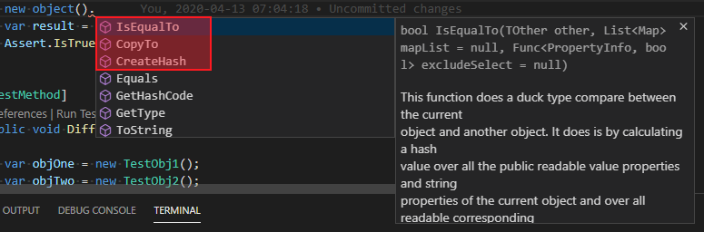
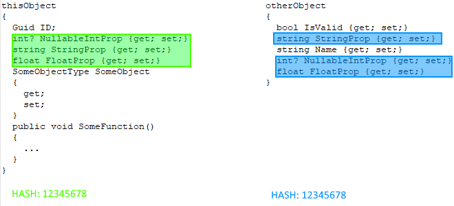

# Data object extension
## Motivation
When you have to deal with multi-tier applications, you often have to deal with
data which crosses the tiers from the UI to the persistence layer and back. Often enough 
each tier has it's own requirement for the data representation, which leads to 
copy operations from the data objects in one tier into the data objects in the 
other tier and vice versa. Some well known examples are the MVVM or the MVC 
frameworks where you have to deal with data objects which fits to the data sink 
(which is in most cases a database) and a view model which fits to the user 
interface representation of the data. Often enough the reality is more complex
like this and you have to deal with a lot more different data models. 
Since the naive way of writing code for this copy operations over and over 
again is cumbersome and error-prone some programmers already thought about a solution for that specific problem. The most famous of them is the [AutoMapper](https://github.com/AutoMapper/AutoMapper)
which is available at GitHub. This solution is similar in many ways but is 
much more light wight. 

Data objects are normally defined as flat objects which have a bunch of properties but no
object hierarchy. For that reason this extension deals only with primitive attributes,
value attributes and strings. The extension ignores every other attributes of 
the participating objects. 

There are three tasks which will always arise when you have to deal with data 
objects.

1) Comparing data objects.  
2) Deciding if a data object has changed.  
3) Copying data from one object to another.  

The following paragraph will tell how to deal with this task by using the 'DataObjectExtension'.

## Usage

### Installing

To install the 'DataObjectExtension' extension you can use the nuget package "DataObjectExtension".

If your project is a dotnet core project and your IDE doesn't offer a package manager for nuget packages, you can use the command below.

```
nuget install "DataObjectExtension"
```
or

```
dotnet add package "DataObjectExtension"
```


If you are using some other kind of nuget package manager use that manager. They often comme with a GUI which simplifies the installation process. 

After the installation you have to reference the 'DataObjectExtension' namespace in every class of your project where you intent to use the extension.

If everything went according to plan, you will have three extension functions on every object.



I'm going to explain the functions in detail in the next paragraphs.

### The 'IsEqualTo' function.

#### Default behavior

The 'IsEqualTo' function does a duck type compare with another function and returns true if the comparison passed, otherwise false. A 'duck type' compare means the 'other' object can be of any type. There is no need that the current object and the other object are of the same type. The other object just has to have properties with the same name and type.

The comparison of the object takes part in three steps.  

At first, the function goes over all readable  primitive, value and string type properties of the current object and creates a hash from their values.  

In a second step, the function looks for readable properties with the same name and type on the 'other' object. The function uses the values of those objects to create a second hash.

In a third step the function compares the hashes and returns true if the hashes are equal, otherwise false.

Here is an example. Lets say you have this two objects.


The 'thisObject' is your current object and you are going to compare the current object with the 'otherObject'.

At first the function goes over all primitive, value and string properties in the current object and creates a hash from their values. The properties which are taken into account are those which are marked green.


In a second step the function goes over all primitive, value and string properties in the 'other' object which have the same name and type as the properties which were use to create the hash in the current object. That are the properties which are marked blue.


In a last step, the function compares both hashes and returns true if the hashes are the same, otherwise false.



The following invocation of the **'IsEqualTo'** function would return true if the compared properties in both objects have equal values.

```C#
thisObject.IsEqualTo(otherObject);
```

#### Comparison with mapping and conversion

That function works pretty well as long as both objects use the same name and type on the properties in question. Unfortunately that's not always the case. 
Often enough you have to deal with different names, different types or both.  
For that reason the function has a 'mapList' parameter which is set to 'null' per default. The 'mapList' parameter is of type **'List&lt;Map&gt;'** and as you might guess, this list of **'Map'** objects is use to map properties from one object to properties on another object. 

The **'Map'** type is defined as:

```C#
  public struct Map
  {
    public string SourceName
    {
      get;
      private set;
    }

    public string TargetName
    {
      get;
      private set;
    }

    public bool IsEmpty
    {
      get
      {
        return ((string.IsNullOrWhiteSpace(SourceName)) || 
                (string.IsNullOrWhiteSpace(TargetName)));
      }
    }

    public Func<object, object> Convert;

    public Map(string sourceName, 
               string targetName, 
               Func<object, object> convert = null)
    {
      ...
    }
  }//END struct

```

As you can see, the **'Map'** type has a **'SourceName'** property and a **'TargetName'** property which is essential to identify the properties which should be mapped.
There is also a **'Convert'** property which is of type **'Func<object, object>'**. This delegate function is use when the mapped properties have different types. The purpose of that function is to convert the value of the source property on the current object into the type of the target property before the hash value gets created.  
Here is an example. Lets say you have two objects like those below.


The default compare function would tell you that the objects are not equal because they have neither a common name for one of the properties nor common types. But you know that the 'Validate' property on the current object can be compared with the 'IsValid' property on the 'other' object which holds either a 'true' or a 'false' string. You also know that the integer value of the 'NumberOfChars' property on the current object can be compared with the boolean property 'IsEmpty' on the 'other' object. 


In order to make that happen you have to use the **'Convert'** delegate on each **'Map'** object for these properties. The **'Convert'** delegate gets the boxed value of the mapped property of the current object as input parameter. The function has to convert that value into the required target type before the value is returned. The returned value will than be used to calculate the hash on the current object. The **'Convert'** function for the first property would look like this:

```C#
(boxedValue) => { return ((bool) boxedValue).ToString().ToLower();}
```

The function takes the incoming boxed value and unboxes the value in a first step.

```C#
((bool) boxedValue)
```

In a second step the boolean value is converted into a string and just to make sure, the string is changed into lower case.

```C#
((bool) boxedValue).ToString().ToLower();
```

The last step is to return the converted value which is now either a 'true' or a 'false' string. Which means, when the hash gets calculated the property value is either the same as the one on the 'other' object or not. Or in other words, will generate the same hash value or not.

For the second property the conversion follows the same rules. The conversion function would look like this:

```C#
(boxedValue) => { return ((int) boxedValue) > 0;}
```

The 'Map' objects for the  mapping would be:

```C#
new Map("Validate",  
        "IsValid",  
        (boxedValue) => { return ((bool) boxedValue).ToString().ToLower();});
```

```C#
new Map("NumberOfChars",  
        "IsEmpty",  
        (boxedValue) => { return ((int) boxedValue) > 0;});
```

The **'SourceName'** and **'TargetName'** properties of the **'Map'** object is used to identify the corresponding properties on the two objects which don't have equal names. The **'Convert'** delegate is used to unify the properties types.  

If the properties would have different names but the same type, you wouldn't use the **'Convert'** function.

You add those mappings to a list of type **'List&lt;Map&gt;'** and call the **'IsEqualTo'** function like that:

```C#
thisObject.IsEqualTo(otherObject, mapList);
```

Now the function would return true for the example objects.

#### Comparison with excluded properties

You may run into a situation where you want to compare two objects but some of the source object properties shouldn't take part into that comparison. May be the target object lacks those properties. Or may be the target object possesses those properties but they have a different meaning on the target object. That is the moment where the exclude selector comes into play. The exclude selector is a predicate delegate. The delegate is defined as:

```C#
Func<PropertyInfo, bool>
```

The exclude selector function gets called for each property on the current object which qualifies as comparable property. The function has than to decide wether the property should take part into comparison or not. If the function returns true for one of the **PropertyInfo** objects, the property will be excluded. Hence the name of that delegate.

Here is an example:


Both objects possess an ID property but those properties have different values because the IDs have meaning in different contexts. To exclude that property from the comparison you have to  use the **'ExcludeSelector'**. The exclude selector for the above example would look like this:

```C#
(property) => { return property.Name == "ID";}
```

The other properties are compared according the default rule which compares the properties which have matching names and values.  

The invocation of the **'IsEqualTo'** should look like that:

```C#
thisObject.IsEqualTo(otherObject, null, (property) => { return property.Name == "ID";});
```

The result would be true, because the remaining properties are equal. Of course it's possible to combine the default compare rules, the mapping and the exclude selector in one **'IsEqualTo'** function call. 

### Copying into the target object

The **'CopyTo'** extension function works with the same function parameters as the **'IsEqualTo'** extension function. The function parameter have the same meaning, except that they are used to select, convert and exclude the properties from the source object which will be copied to the target object. They are not longer used for comparison in that case. 

That means, if the set of function parameter which was used in a comparison function lead to the result that the objects are equal, there is no reason for a copy operation. On the other hand, if the result revealed that the objects are different, you are going to use the same function parameter which you use during comparison in the copy function.

### Creating a hash for change detection

The **'CreateHash'** extension function creates a hash over the current object. The hash is a byte array which is create by the internally used SHA256 hash algorithm. The properties whose values will go into the hash calculation are selected according to the default rules.  
The **"CreateHash'** function can also be use with an **'ExcludeSelector'** delegate to exclude some properties from hashing which otherwise would contribute to the created hash.  
The **'CreateHash'** doesn't offer a convert delegate because it doesn't make any sense in this context. If you need to know that your object has or has not changed during an operation you have to create a hash before and after the operation. If the hashes are equal, the object hasn't changed. The workflow looks like this:

```C#
var hashBefore = thisObject.CreateHash();

//
// Doing some work where the object state might change.
//

var hashAfterwards = this.Object.CreateHash();
var unchanged = hashBefore.SequenceEqual(hashAfterwards);

//
// If unchanged is true, nothing has changed.
//
```
### General remarks

There is no compile time support for the extension functions. Because the state of the objects the extension function have to deal with can only be evaluated at runtime. The functions might throw exceptions at any time. That might be no big deal if it happens during a compare operation. That wouldn't harm the object state since the compare operation doesn't change the object state. But it might also happen during a copy operation. In that case the target object state is undefined.  
For that reason serious testing is inevitable to make sure that everything works as expected.

### Technical documentation

You will find the technical documentation in the **'DOCS/html'** folder.  
[index](./DOCS/html/index.html "index.html")

### License

This project is licensed under the Microsoft Public License (MS-PL). See   [https://opensource.org/licenses/MS-PL](https://opensource.org/licenses/MS-PL)  
for more information.


